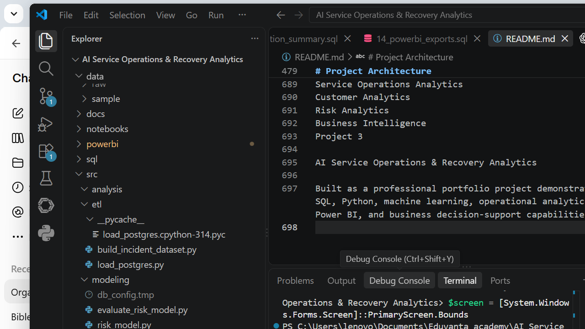

# AI Service Operations & Recovery Analytics

## An End-to-End Service Operations Risk Intelligence & Recovery Analytics Platform

**Author:** Adekanmi Adeyemi Isreal

---

## Project Overview

AI Service Operations & Recovery Analytics is an end-to-end data analytics project designed to analyze service incidents, identify prolonged-resolution risk, measure operational complexity, develop risk intelligence, and support data-driven service recovery decisions.

The project combines:

- PostgreSQL
- SQL analytics
- Python
- Pandas
- Machine Learning
- Power BI
- Git/GitHub

The objective is to move beyond descriptive reporting toward an operational risk intelligence system that helps service teams understand **which incidents require greater attention, why they may become prolonged, and what type of recovery response may be appropriate.**

---

# Business Problem

Service operations teams handle large volumes of incidents, but not every incident presents the same level of operational risk.

Some incidents may:

- Require repeated reassignment
- Be reopened multiple times
- Pass through many state transitions
- Require repeated modifications
- Be associated with symptoms that show higher prolonged-resolution rates
- Become prolonged despite appearing ordinary at intake

Without structured analytics, service teams may struggle to identify these patterns early.

This project addresses the following business questions:

1. How many incidents are being handled?
2. How many incidents experience prolonged resolution?
3. What proportion of incidents become prolonged?
4. Which incidents demonstrate elevated operational risk?
5. How does operational complexity relate to prolonged resolution?
6. Which symptoms are associated with elevated prolonged-resolution risk?
7. Can incident attributes available at intake support early risk assessment?
8. How can risk intelligence support targeted service recovery recommendations?

---

# Project Objectives

The project was designed to:

- Build a structured service incident analytics foundation
- Analyze incident lifecycle behavior
- Analyze state transitions
- Measure operational complexity
- Analyze resolution outcomes
- Identify prolonged-resolution patterns
- Build symptom-level risk intelligence
- Combine symptom and complexity risk
- Develop baseline machine-learning risk modeling
- Develop a leakage-safe intake risk model
- Produce service recovery recommendations
- Build an executive Power BI dashboard
- Create reproducible SQL and Python analytical workflows

---

# Dashboard Preview

### Executive Service Operations Dashboard



---


# Key Project KPIs

| KPI | Result |
|---|---:|
| Total Incidents | 20,766 |
| Prolonged Resolution Incidents | 2,077 |
| High-Risk Incidents | 548 |
| Overall Prolonged Resolution Rate | 10.00% |

These KPIs form the core executive summary of the Power BI dashboard.

---

# Data & Analytical Foundation

The project uses a structured service incident dataset containing operational, lifecycle, resolution, and incident-management attributes.

Key fields include:

- Incident ID
- Caller
- Opened/created timestamps
- Resolution and closure timestamps
- Incident state
- Contact type
- Location
- Category
- Subcategory
- Symptom
- Impact
- Urgency
- Priority
- Assignment group
- Knowledge usage
- Vendor
- SLA status
- Reassignment count
- Reopen count
- Modification count
- Resolution hours
- Closure hours
- Resolution-to-closure hours

The analytical pipeline transforms these operational records into risk, complexity, outcome, and recovery intelligence.

---

# SQL Analytics

PostgreSQL was used as the primary analytical database.

The SQL layer was developed as a structured sequence of analysis modules.

## SQL Schema

The project includes SQL scripts for:

- Creating database tables
- Aligning and validating the database schema

## Incident Analytics

The analysis covers:

### 1. Incident Lifecycle Analysis

Analyzes the lifecycle of incidents from creation through resolution and closure.

### 2. State Transition Analysis

Measures changes between incident states and reconstructs operational movement through the service process.

### 3. Incident Complexity

Creates an operational complexity score based on incident handling activity.

The complexity score incorporates:

- State transitions
- Reassignments
- Reopens
- Modifications

### 4. Complexity Summary

Groups incidents into operational complexity bands:

- Low
- Medium
- High

Observed incident distribution:

| Complexity Band | Incidents |
|---|---:|
| Low | 16,633 |
| Medium | 3,869 |
| High | 267 |

Observed prolonged-resolution rates:

| Complexity Band | Prolonged Rate |
|---|---:|
| Low | 1.94% |
| Medium | 38.67% |
| High | 97.00% |

These results demonstrate a strong relationship between operational complexity and prolonged resolution within the analyzed dataset.

---

# Resolution Outcome Analysis

Resolution outcomes were analyzed to distinguish normal-resolution incidents from prolonged-resolution incidents.

The project identified:

- **20,766 total incidents**
- **2,077 prolonged-resolution incidents**
- **10.00% overall prolonged-resolution rate**

This outcome variable became the target for subsequent risk modeling.

---

# Symptom Risk Intelligence

The project developed symptom-level risk profiling to identify symptoms associated with higher prolonged-resolution rates.

The analysis incorporates:

- Incident count
- Prolonged incident count
- Prolonged-resolution rate
- Smoothed prolonged-resolution rate
- Risk lift relative to the overall rate
- Average complexity
- Average reassignment activity
- Average reopen activity

A smoothing approach was applied to reduce instability in risk estimates for symptoms with relatively small incident counts.

---

# Combined Risk Intelligence

The project combines two major risk dimensions:

1. **Symptom-associated risk**
2. **Operational complexity risk**

This produces four combined risk groups:

| Risk Group |
|---|
| Standard — Neither |
| Elevated — Complexity Only |
| Elevated — Symptom Only |
| High — Complexity + Symptom |

The highest-risk group represents incidents where both symptom-associated risk and operational complexity are elevated.

The combined risk framework is used as the foundation for the service recovery recommendation layer.

---

# Machine Learning Risk Modeling

Two different modeling approaches were developed.

## Baseline ML Risk Model

The baseline model used operational features associated with incident handling and prolonged resolution.

### Evaluation Results

| Metric | Result |
|---|---:|
| Accuracy | 92.08% |
| Precision | 56.53% |
| Recall | 89.64% |
| Specificity | 92.35% |
| ROC-AUC | 0.9650 |

### Confusion Matrix

| | Predicted Negative | Predicted Positive |
|---|---:|---:|
| Actual Negative | 3,453 | 286 |
| Actual Positive | 43 | 372 |

The baseline model demonstrated strong discrimination, but the project identified an important modeling concern: some operational variables may only become available after incident activity has occurred.

That led to the development of a leakage-safe model.

---

# Leakage-Safe Intake Risk Model

A second model was developed specifically to address **target leakage**.

The purpose of this model is to evaluate whether risk can be assessed using information available at incident intake rather than relying on variables generated later during incident handling.

## Intake-Time Features

The leakage-safe model uses:

- Contact type
- Location
- Category
- Subcategory
- Impact
- Urgency
- Priority
- Assignment group
- Knowledge
- Priority confirmation
- Notification
- Vendor
- SLA status

## Explicitly Excluded

The following were excluded from the intake model:

- Post-resolution outcome variables
- Final operational counts
- Symptom outcome-rate features
- Other variables that depend on incident activity occurring after intake

## Evaluation Results

| Metric | Result |
|---|---:|
| Accuracy | 76.29% |
| Precision | 24.04% |
| Recall | 63.61% |
| Specificity | 77.69% |
| ROC-AUC | 0.7730 |

### Confusion Matrix

| | Predicted Negative | Predicted Positive |
|---|---:|---:|
| Actual Negative | 2,905 | 834 |
| Actual Positive | 151 | 264 |

The leakage-safe model provides a more realistic foundation for early-stage incident risk assessment.

---

# Service Recovery Recommendations

The project translates risk intelligence into operational recovery recommendations.

The recommendation layer connects:

**Combined Risk → Incident Volume → Prolonged Resolution Rate → Recommended Recovery Action**

The recovery recommendation summary contains:

- Combined risk
- Incident count
- Percentage of all incidents
- Primary recommendation
- Prolonged incident count
- Prolonged rate

This allows service operations teams to prioritize intervention rather than treating all incidents equally.

---

# Power BI Executive Dashboard

The completed Power BI dashboard provides an executive view of service operations risk and recovery intelligence.

## KPI Cards

The dashboard contains four primary KPI cards:

### Total Incidents

**20,766**

### Prolonged Resolution Incidents

**2,077**

### High-Risk Incidents

**548**

### Overall Prolonged Resolution Rate

**10.00%**

---

# Dashboard Visualizations

## Risk Intelligence

### Incident Distribution by Combined Risk

Shows the distribution of incidents across the combined risk categories.

### Prolonged Incidents by Combined Risk

Shows the number of prolonged incidents within each risk category.

### Prolonged Resolution Rate by Combined Risk

Shows the prolonged-resolution rate across the combined risk categories.

---

# Operational Complexity

### Incident Distribution by Complexity

Shows the number of incidents within:

- Low
- Medium
- High complexity

### Prolonged Resolution Rate by Complexity

Shows how prolonged-resolution rates change across operational complexity levels.

---

# Service Recovery

### Service Recovery Recommendations by Risk

The dashboard includes a recovery recommendation table containing:

- Combined risk
- Incident count
- Percentage of all incidents
- Primary recommendation
- Prolonged rate

This connects the analytical findings to potential operational action.

---

# Python & ETL Pipeline

Python was used to support the data engineering and modeling workflow.

The project includes:

## ETL

### `build_incident_dataset.py`

Builds the analytical incident dataset used by downstream analysis.

### `load_postgres.py`

Supports loading and working with the PostgreSQL analytical database.

---

# Python Risk Modeling

The modeling layer includes:

### `risk_model.py`

Supports the risk-modeling workflow and modeling dataset construction.

### `evaluate_risk_model.py`

Evaluates the machine-learning models and reports:

- Confusion matrix
- Accuracy
- Precision
- Recall
- Specificity
- ROC-AUC
- Model features
- Leakage-control results

---

# Technology Stack

| Technology | Purpose |
|---|---|
| PostgreSQL | Data storage and analytical database |
| SQL | Data modeling and analytical transformations |
| Python | ETL, processing and modeling |
| Pandas | Data manipulation and analysis |
| Scikit-learn | Machine learning |
| Power BI | Executive dashboard and visualization |
| Git | Version control |
| GitHub | Portfolio repository |

---

# Project Architecture

```text
AI Service Operations & Recovery Analytics
│
├── data/
│   ├── powerbi/
│   └── processed/
│
├── powerbi/
│   └── AI Service Operations & Recovery Analytics.pbix
│
├── sql/
│   ├── schema/
│   │   ├── 01_create_tables.sql
│   │   └── 02_align_schema.sql
│   │
│   └── analysis/
│       ├── 01_incident_lifecycle.sql
│       ├── 02_state_transition_analysis.sql
│       ├── 03_incident_complexity.sql
│       ├── 04_complexity_summary.sql
│       ├── 05_resolution_outcome.sql
│       ├── 06_incident_risk_features.sql
│       ├── 07_risk_baseline_evaluation.sql
│       ├── 08_symptom_risk_profile.sql
│       ├── 09_symptom_risk_score.sql
│       ├── 10_incident_symptom_features.sql
│       ├── 11_combined_risk_intelligence.sql
│       ├── 12_service_recovery_recommendations.sql
│       ├── 13_recovery_recommendation_summary.sql
│       └── 14_powerbi_exports.sql
│
├── src/
│   ├── etl/
│   │   ├── build_incident_dataset.py
│   │   └── load_postgres.py
│   │
│   └── modeling/
│       ├── evaluate_risk_model.py
│       └── risk_model.py
│
├── app/
├── docs/
├── notebooks/
├── .gitignore
└── README.md
Project Workflow

The completed analytical workflow is:

Service Incident Data
        ↓
PostgreSQL Data Foundation
        ↓
SQL Incident & Lifecycle Analysis
        ↓
Operational Complexity Analysis
        ↓
Resolution Outcome Analysis
        ↓
Symptom Risk Intelligence
        ↓
Combined Risk Intelligence
        ↓
Python Risk Modeling
        ↓
Leakage-Safe Intake Modeling
        ↓
Service Recovery Recommendations
        ↓
Power BI Executive Dashboard
Key Analytical Findings

The project demonstrates several important patterns within the analyzed dataset.

1. Prolonged resolution is not evenly distributed

Of 20,766 incidents, 2,077 were classified as prolonged-resolution incidents.

This produces an overall prolonged-resolution rate of 10.00%.

2. Operational complexity is strongly associated with prolonged resolution

The observed prolonged-resolution rates increase substantially across complexity bands:

Low: 1.94%
Medium: 38.67%
High: 97.00%
3. Combined risk provides stronger operational segmentation

Combining symptom-associated risk with operational complexity creates a four-group risk framework that distinguishes standard incidents from elevated and high-risk incidents.

4. Early prediction is more challenging than retrospective prediction

The baseline model achieved a ROC-AUC of 0.9650, while the leakage-safe intake model achieved 0.7730.

This difference highlights the importance of separating variables available after incident handling from variables genuinely available at intake.

5. Risk modeling should account for operational timing

A model can appear highly accurate if it uses information that only becomes available after the outcome has developed.

The leakage-safe model was therefore developed to provide a more realistic representation of early intervention potential.

Data Leakage Control

One of the key analytical improvements in this project was explicit leakage control.

The modeling workflow distinguishes between:

INTAKE-TIME INFORMATION
        ↓
EARLY RISK ASSESSMENT

and:

POST-INTAKE OPERATIONAL ACTIVITY
        ↓
OUTCOME / RETROSPECTIVE ANALYSIS

Variables that depend on later incident activity were excluded from the leakage-safe intake model.

This improves the credibility of the predictive modeling workflow and demonstrates an important real-world machine-learning consideration.

GitHub & Reproducibility

The project is version-controlled with Git and published on GitHub.

Large generated datasets and local database configuration files containing credentials are intentionally excluded from version control.

The repository focuses on the reusable analytical components:

SQL scripts
Python ETL
Python modeling
Power BI dashboard
Analytical outputs
Project documentation
Completed Work

The following project components have been completed:

 PostgreSQL database foundation
 Incident lifecycle analysis
 State transition analysis
 Operational complexity scoring
 Complexity band analysis
 Resolution outcome analysis
 Symptom risk profiling
 Symptom risk scoring
 Combined risk intelligence
 Baseline machine-learning risk model
 Leakage-safe intake risk model
 Risk model evaluation
 Service recovery recommendation logic
 Power BI data exports
 Executive Power BI dashboard
 Four executive KPI cards
 Five analytical dashboard visuals
 Service recovery recommendation table
 Dashboard title/cover page
 Git repository initialization
 .gitignore configuration
 Initial Git commit
 GitHub repository connection
 Main branch pushed to GitHub
Portfolio Value

This project demonstrates an end-to-end approach to solving a real-world service operations analytics problem.

It combines:

Data Engineering

→ PostgreSQL schema and data preparation

SQL Analytics

→ lifecycle, complexity, resolution and risk analysis

Python

→ ETL, feature preparation and modeling

Machine Learning

→ baseline and leakage-safe risk prediction

Business Intelligence

→ Power BI executive reporting

Decision Support

→ service recovery recommendations

The project therefore demonstrates more than dashboard creation; it shows how raw operational data can be transformed into analytical intelligence and actionable business recommendations.

Author
Adekanmi Adeyemi Isreal

Educator & EdTech Practitioner Transitioning into Data & Business Analytics

Areas of interest include:

Data Analytics
Business Analytics
EdTech Analytics
Educational Analytics
Service Operations Analytics
Customer Analytics
Risk Analytics
Business Intelligence
Project 3

AI Service Operations & Recovery Analytics

Built as a professional portfolio project demonstrating SQL, Python, machine learning, operational analytics, Power BI, and business decision-support capabilities.


